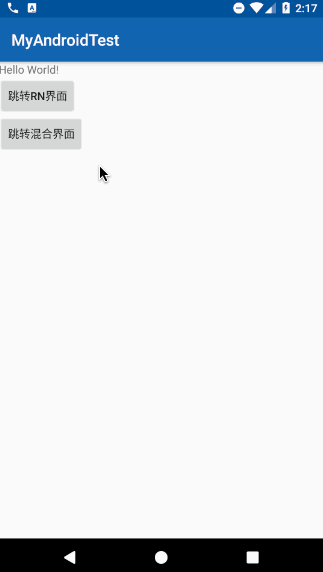
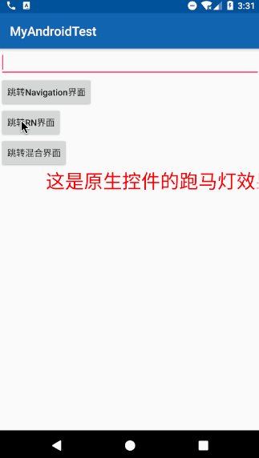
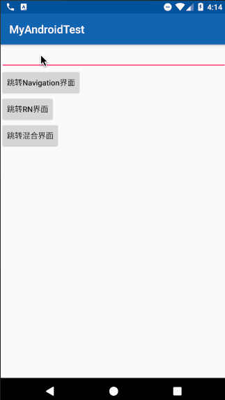

# RNApp

## RN与Android混合练习Demo

此Demo有入下功能

1. 原生模块封装-封装Android的Toast
2. 通过Callbacks原生想js传递数据
3. 通过Promises的方式原生想js传递数据
4. 原生界面与RN界面互相调用
5. Activity中既有原生控件又有RN控件
6. RN中实现类似Android中的帧动画及坑

**效果图：**

7. RN调用原生UI组件的方法

8. 混合开发中实现原生传入的参数跳转不同RN界面

8. 解决activity启动RN白屏现象
